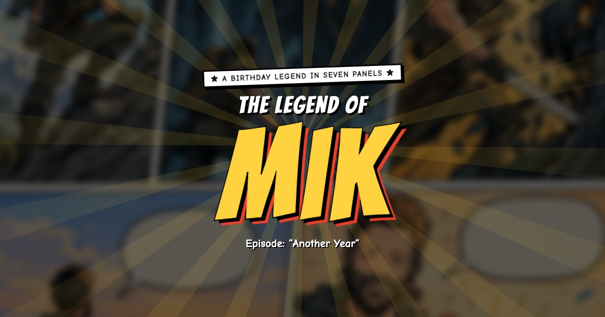

# The Legend of Mik

Hey Mik: happy birthday, legend! Level 37 is unlocked, and 37 is prime, just like you. Everyone else: welcome, traveller. You've found a birthday card that got slightly out of hand. It's a comic in seven panels where you sketch a hero, climb a whole year, fight the Beast of Adulting (it comes back every Monday) and blow out 37 candles. **[▶ Start the quest](https://durchnull.github.io/legend-of-mik/)**, with the sound on. It works on phone and desktop.

Twelve easter eggs are hidden inside, and we won't spoil a single one. Poke everything. Seriously, everything. Under the hood it's one `index.html`: no build step, no tracking, no outside requests. The art, fonts and code all live in that one file. Want a legend of your own? Add `?name=YourFriend` to the link, or fork the repo and edit the `CONFIG` block. Fair warning: the number 37 is load-bearing.
